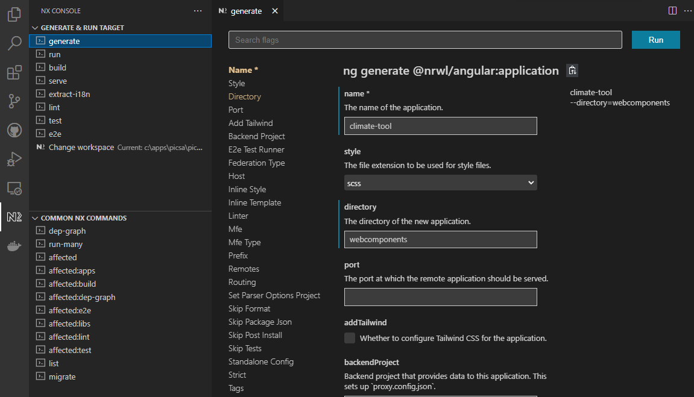

# Apps

## Adding a new native app

## Adding a new webcomponent

Webcomponents can be build in any valid way, however for the project most are typically built with Angular Elements

A new wecomponent application can be registered using the NX Console

