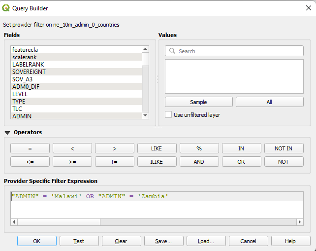
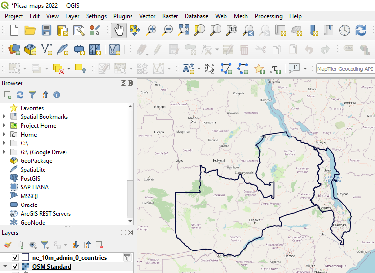
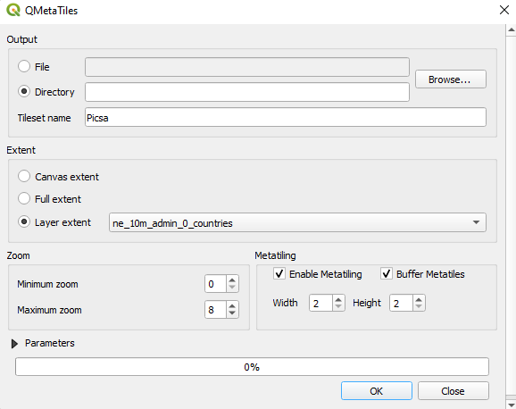
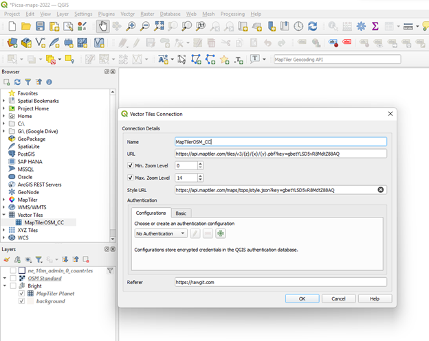

The PICSA Map has a base world outline and some specific country outlines.
There is also an optional online baselayer of a full map from openstreetmap

## About the Data

The map data consists of baselayer images and geojson overlay

The geojson is downloaded from natural earth, and optimised by:

1. Filter to only include countries used for PICSA app
2. Remove columns to only keep those use for PICSA app (currently just admininistrative name)
3. Converting to topojson

This should result in drastic reduction, e.g. just retaining admin features and
restricting to africa world geoJson compresses 839KB -> 23KB (40x!)

## Adding GeoJson Data

Data can be downloaded from: https://www.naturalearthdata.com/downloads/

For example country boundaries can be exported from
https://www.naturalearthdata.com/downloads/10m-cultural-vectors/

Once downloaded it should be processed using QGIS (or similar) to remove features.
For example, see the screenshot below to filter to only include a small number of countries


## Frontend integration

The frontend is map is built with leaflet JS. CSS will need to be included either via a scss import statement or bundled into the build, e.g.

```
 "styles": [
        "styles.css",
        "./node_modules/leaflet/dist/leaflet.css"
    ],
```

## Adding offline basemap

Basemap tiles should be exported as raster images (e.g. PNG) from QGIS.
The easiest way to load basemap tiles is via the `QuickMapServices` plugin to load an OSM layer

This layer can be exported and clipped to the geojson layer using the `QMetaTiles` plugin\

An example of a basemap with geojson layer can be seen below


When exporting the basemap can be clipped to the geojson layer extent


Typically zoom level of 7-8 should be sufficient, but this can be explored online at https://www.openstreetmap.org/#map=8/-14.837/35.057 (zoom level in url)

### Compress tiles

The downloaded tiles are typically not compressed very well and so an extra step should be taken to make the files smaller. A lightweight script is included here, which can be run via:

```
yarn ts-node tools\workflows\processMapTiles.ts
```

The compressed files should appear same folder as webp images

### Copy to assets

This folder should be copied to the project assets folder, where the map tiles will be served from

###

The final step is to set the attribute on the picsa-map tag to use local images,
this can be done by setting any properties within assetMapOptions. i.e.

```
 basemapOptions: IBasemapOptions = {
    src: 'assets/mapTiles/raw/{z}/{x}/{y}.webp',
    maxNativeZoom: 8
  };

```

(component.ts)

```
<picsa-map
      [basemapOptions]="basemapOptions"
    ></picsa-map>

```

(component.html)

## Vector basemaps

QGIS added support for vector basemaps as of v3.14, however integration within the app is not straightforward.
Some preliminary work has been done to include, however on hold until there is greater need for it

This work is split into a few components

1. Source of vector basemaps
   This could be something such as
   https://data.maptiler.com/downloads/dataset/osm/#0.22/0/0
   https://openmaptiles.org/
   NOTE - as well as map server url will also need to take note of `tiles.json` and `style.json` files which contain map definition data

2. Use of QGIS to load vector basemaps. See article below for explanation of how to configure
   https://wanderingcartographer.wordpress.com/2021/01/09/qgis-3-and-vector-map-tiles/

E.g. see below for adding a testing set of map vector tiles from maptiler.


Maptiler also has its own plugin to import from their global repositories (search 'maptiler')

3. Ability to merge multiple sources (if required). E.g. maptiler examples typically include vector basemap along side hill shading and contour line raster maps. It is not clear if QGIS can fully support these formats.
   E.g. issue: https://github.com/geometalab/Vector-Tiles-Reader-QGIS-Plugin/issues/266

4. Troubleshoot compatibility issues, e.g. installing missing font files (as shown in )

5. Find means to export tile subset (seems like qmetatiles only supports pngs, not vector pbf files)

6. Parse vector files to geojson
   As vectors are encoded using protobuf additional work required to decode either during map render or as a precompile step.
   https://github.com/mapbox/pbf

7. Integrate with leafletjs in frontend,e.g.
   https://github.com/mapbox/mapbox-gl-leaflet
   https://github.com/Leaflet/Leaflet.VectorGrid

8. Evaluate space saved / quality gained from method overall

## Additional Optimisations

Previously some work was done to explore use of topojson, however currently on hold
https://jeffpaine.github.io/geojson-topojson/ or
https://mygeodata.cloud/converter/geojson-to-topojson
